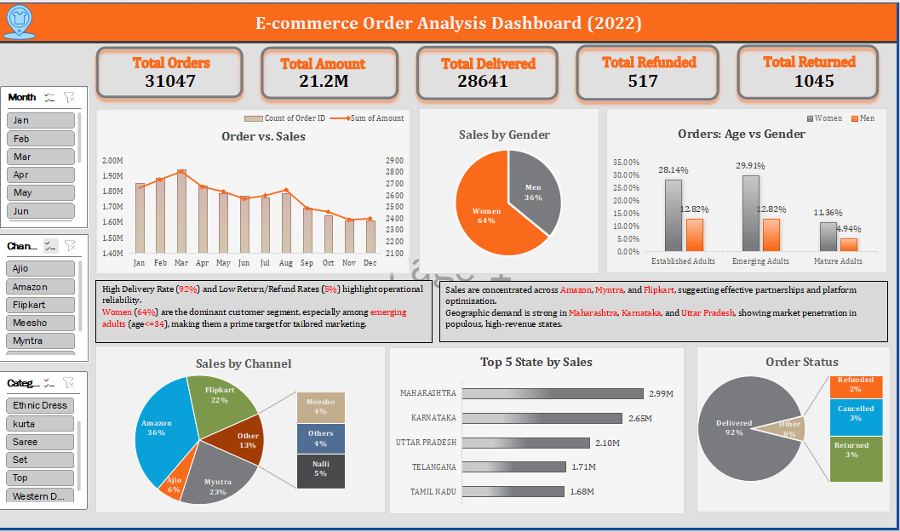

# 🛒 E-commerce Order Analysis Dashboard (2022)

This project presents a comprehensive dashboard created using **Microsoft Excel** to analyze e-commerce order data from the year 2022. It provides key insights into customer demographics, sales trends, operational performance, and regional patterns.

---

## 📌 Objective

To analyze order data and uncover actionable insights to improve customer targeting, delivery efficiency, and sales performance using Excel-based visual analytics.

---

## ✅ Key Questions Answered

- 📦 What are the total orders, delivered, returned, and refunded counts?
- 📈 What are the monthly trends in orders and total sales amount?
- 👨‍👩‍👧‍👦 What is the gender and age-wise distribution of customers?
- 🛍️ Which channels (Amazon, Flipkart, etc.) contribute most to sales?
- 📍 Which states are the top performers in terms of sales?
- 🔁 What is the breakdown of order statuses?

---

## 📊 Tools Used

- **Microsoft Excel**
  - Pivot Tables
  - Charts (Pie, Column, Line, Bar)
  - Slicers for filters (Month, Channel, Category)
  - Data cleaning using formulas
  - Dashboard formatting and design

---

## 🔍 Data Preprocessing in Excel

- **Gender Column**: Encoded `'M'` as `"Men"` and `'W'` as `"Women"`  
- **Age Grouping**: Created a new column based on customer age:
  - `<=17` ➝ `"Youth"`
  - `<=34` ➝ `"Emerging Adults"`
  - `<=54` ➝ `"Established Adults"`
  - `>54` ➝ `"Mature Adults"`
- **Quantity Mapping**:
  - `"one"` ➝ `1`
  - `"two"` ➝ `2`

---

## 📈 Key Insights

1. **High Female Engagement**  
   - Women account for **64%** of the customer base, indicating a strong preference among female shoppers.

2. **Top Age Group: Emerging Adults (18–34)**  
   - This segment contributes the highest number of orders, making it a prime group for targeted marketing.

3. **Sales Channels**  
   - Flipkart and Amazon dominate, together contributing over **60%** of total sales.  

4. **Top States by Sales**  
   - **Maharashtra, Karnataka**, and **Uttar Pradesh** lead in sales volume, offering a strong base for regional expansion.

5. **Operational Performance**  
   - **92%** of orders are delivered successfully, with only **3%** cancelled and **2%** refunded, indicating high efficiency.

---

## 💡 Recommendations

- 🎯 **Target Female Shoppers in the 18–34 Age Group**  
  Design campaigns and personalized offers focused on this segment.

- 🚚 **Enhance Delivery Performance Further**  
  Continue optimizing logistics to reduce the return and refund rates even more.

- 🌍 **Strengthen Presence in High-Sales States**  
  Consider exclusive deals or faster delivery options for top-performing states like Maharashtra and Karnataka.

- 📦 **Partner More with Amazon and Flipkart**  
  Expand promotions on these channels to leverage their wider customer base.

## 📌 Dashboard Snapshot

---
